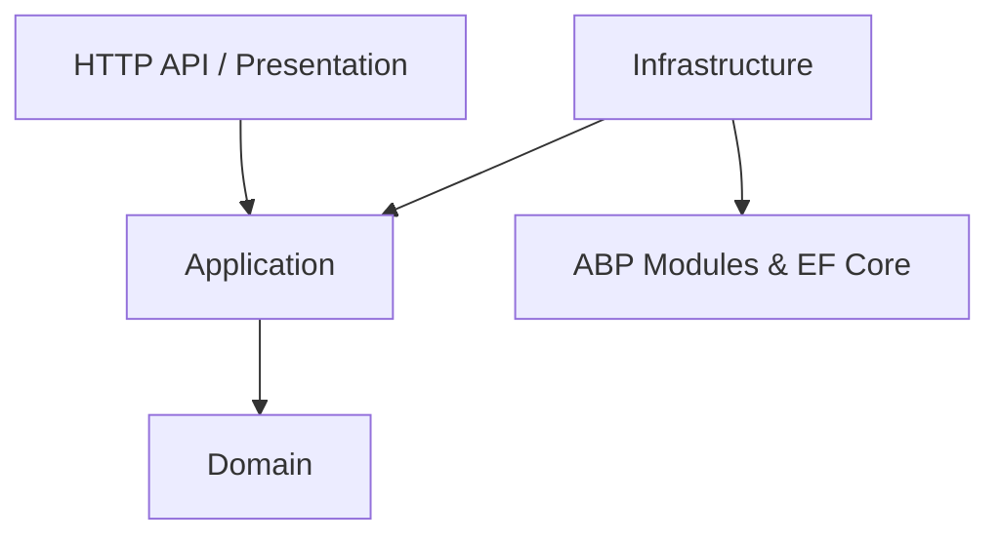

# 🏗️ EnterpriseKit V2 — .NET 10 Enterprise Starter Kit

[](https://github.com/qmmughal/enterprise-starter-kit-v2/actions/workflows/ci.yml)
[](https://dotnet.microsoft.com/)
[](https://abp.io/)
[](LICENSE)

A **production-grade, open-source Enterprise Starter Kit** designed for building highly scalable, maintainable, and modular applications. 

This repository bridges the gap between strict **Clean Architecture** boundaries and the modular, feature-rich capabilities of the **ABP Framework**. 

## ✨ Key Features & Architecture
- **.NET 10 & C# 14**: Leveraging the latest language features and runtime performance improvements.
- **Strict Clean Architecture**: Core domain logic has zero dependencies on frameworks or infrastructure.
- **CQRS with MediatR**: Commands and Queries are strictly separated, ensuring distinct read and write models. 
- **ABP Framework 10.4**: Integrated strictly at the Infrastructure layer for Cross-Cutting concerns (Identity, Multitenancy, OpenIddict).
- **Transactional Outbox Pattern**: Guaranteed local domain event delivery and distributed messaging using background workers (no dual-write problems).
- **Central Package Management**: Enforced using `Directory.Packages.props` for all NuGet dependencies.
- **PostgreSQL & Redis**: Pre-configured infrastructure using Entity Framework Core 10 and StackExchange.Redis.
- **Pipeline Behaviors**: Automatic logging, FluentValidation, and EF Core Transaction management wrapping MediatR requests.

---

## 📁 Repository Structure

The monorepo uses a strictly layered approach to enforce dependency rules (Inner layers know nothing of outer layers):



- `src/Domain`: Enterprise business rules, Entities, Value Objects, Domain Exceptions, and Interface abstractions.
- `src/Application`: Application business rules, CQRS Handlers (Commands/Queries), DTOs, and FluentValidation validators.
- `src/Infrastructure`: Implementation of interfaces, EF Core DbContext, Outbox pattern relay, and ABP Framework integrations.
- `src/HttpApi`: REST endpoints, Controllers, Swagger/OpenAPI setup, and Middleware pipelines.

---

## 🚀 Getting Started

### Prerequisites
- [.NET 10 SDK](https://dotnet.microsoft.com/en-us/download/dotnet/10.0)
- Docker & Docker Compose
- (Optional) EF Core CLI `dotnet tool install --global dotnet-ef`

### 1. Spin up Infrastructure dependencies
From the root of the project, start the required PostgreSQL and Redis containers:
```bash
docker-compose up -d
```
*Note: A `docker-compose.override.yml` is included for local port bindings.*

### 2. Apply EF Core Migrations
The application is configured to automatically apply pending migrations on startup in Development and Staging environments. Alternatively, you can apply them manually:

```bash
cd src/Infrastructure/EnterpriseKit.Infrastructure
dotnet ef database update -s ../../HttpApi/EnterpriseKit.HttpApi/EnterpriseKit.HttpApi.csproj
```

### 3. Run the Application
Start the REST API:
```bash
cd src/HttpApi/EnterpriseKit.HttpApi
dotnet run
```
Once started, navigate to `https://localhost:5001` (or whichever port Kestrel bounds to) to view the **Swagger OpenAPI documentation**.

---

## 🛠️ The Outbox Pattern Explained

To prevent distributed data inconsistency ("Dual-Write Problem"), this kit utilizes the **Transactional Outbox Pattern**.

1. When a Domain Entity emits an `IDomainEvent` (e.g., `OrderPlacedEvent`), the event is intercepted during `DbContext.SaveChangesAsync()`.
2. The event is serialized into a generic `OutboxMessage` entity.
3. Both the domain changes and the Outbox message are committed to the database in **a single atomic transaction**.
4. The `OutboxRelayService` (a background `IHostedService`) continuously polls the database for unpublished messages and dispatches them via MediatR's `IPublisher`.

---

## 🏗️ Code Quality & CI/CD
- **Global Analyzers**: Strict C# analyzers are enabled (`<EnableNETAnalyzers>true</EnableNETAnalyzers>`) with `AnalysisMode=Recommended`.
- **GitHub Actions**: Every Pull Request and push to `main` runs a workflow (`.github/workflows/ci.yml`) to compile the solution and execute the `xUnit` test suites.

## 📄 License
This project is licensed under the MIT License - see the [LICENSE](LICENSE) file for details.
